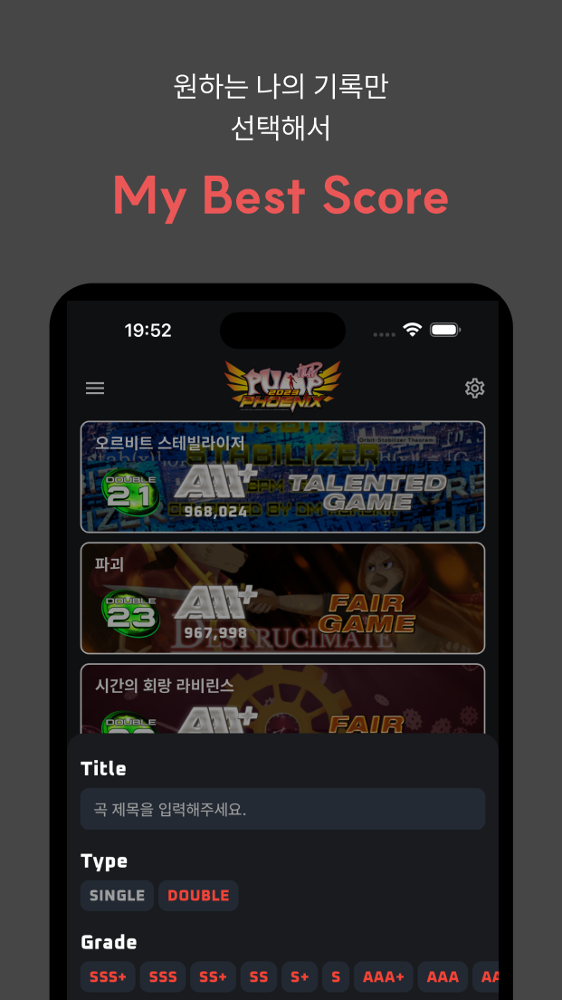
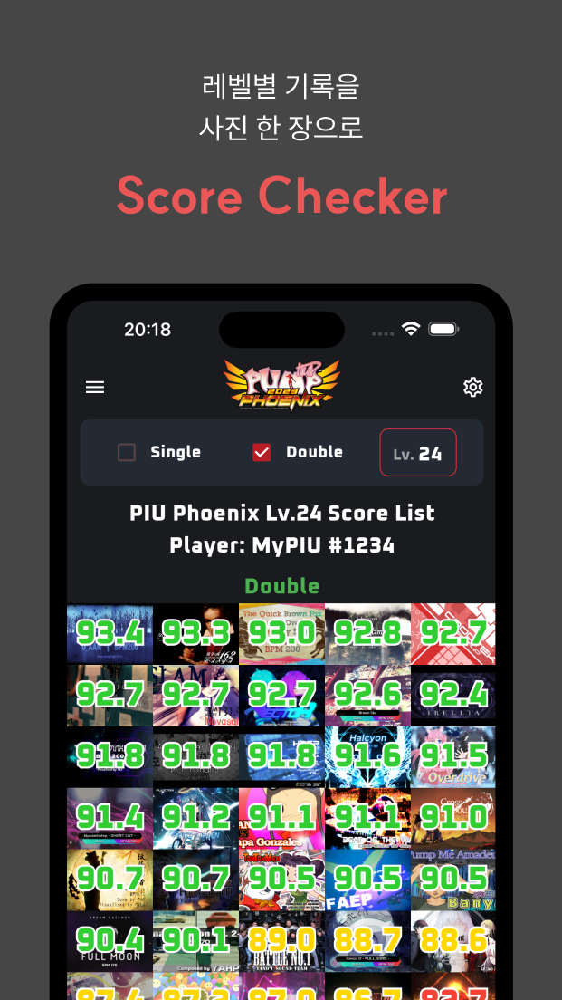
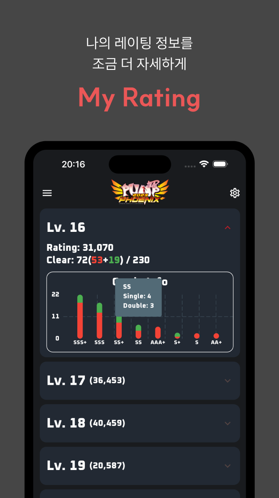
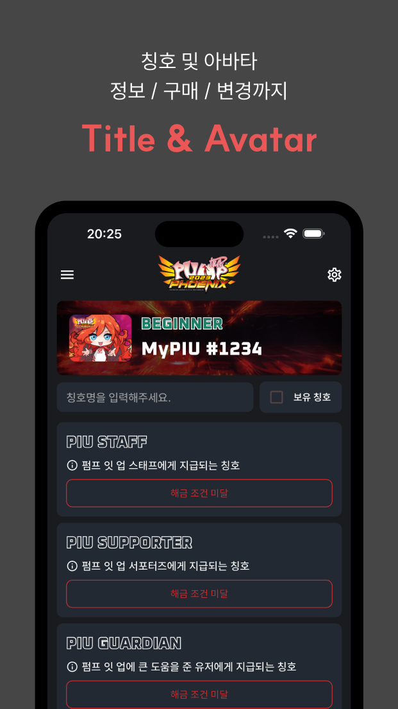

# MyPIU

### Pump It Up을 더 편리하고 자세하게.


## 프로젝트 소개

- [Pump It Up 공식 홈페이지](https://piugame.com/)를 Application으로 포팅
- 공식 홈페이지의 기능 + @를 제공하기 위해 제작되었습니다.

## Environment

```
- Date: 2024-03-09 ~ 2024-03-22
- Flutter: 3.19.2
- Dart: 3.3.0
- OS: macOS 14.4
- IDE: VSCode
```

## Tech Stacks

### GetX

- State / Route / Dependency Management를 위해 사용하였습니다.

### Dio + dio_cookie_manager

- Network 통신 및 Session 유지를 위해 사용하였습니다.
- 공식 홈페이지의 기형적인 Login Redirection 및 Session Expired를 처리하기 위해 Interceptor를 추가적으로 사용하였습니다.

### Freezed

- Immutable한 Data Class를 생성하기 위해 사용하였습니다.

### flutter_screenutil

- 반응형 디자인을 구현하기 위해 사용하였습니다.

### flutter_secure_storage

- 사용자의 로그인(Email / PW) 정보를 안전하게 저장하기 위해 사용하였습니다.

## Project Structure

- Clean Architecture + MVVM을 기반으로 프로젝트 구조를 구성하였습니다.

```
├── android
├── assets
├── ios
└── lib
    ├── app
    │   ├── config
    │   │   ├── extension
    │   │   └── routes
    │   ├── network
    │   │   ├── builder
    │   │   └── interceptor
    │   └── service
    ├── data
    │   ├── datasources
    │   │   └── local
    │   ├── models
    │   └── repositories_impl
    ├── domain
    │   ├── entities
    │   ├── enum
    │   ├── repositories
    │   └── usecases
    └── presentation
        └── feature
            ├── view_models
            └── views
```

## Project Management / Branch Strategy

- Github Project + Github Flow를 통해 Task를 관리하였습니다.
- Issue를 통해 Task를 생성, PR을 통해 Rebase Merge를 진행하였습니다.

## CI/CD

- Github Action을 통해 CI/CD를 구축하였습니다.
- GHA의 macOS 인스턴스 가격이 엄청난 관계로, 개인 Mac Mini(M2)에 Self-Hosted Runner를 구축하여 배포 서버로 이용하였습니다.
- major release는 Shorebird를 적용한 release ipa를 빌드하고, 이를 TestFlight에 배포하게끔 구성하였습니다.
- minor release의 경우, TestFlight에 직접 배포하는 대신 Shorebird를 통해 patch 형태로 배포를 진행하였습니다.

## 기능

| 베스트 스코어                          | 스코어 체커                               |
| -------------------------------------- | ----------------------------------------- |
|  |  |

| 나의 레이팅                       | 칭호 & 아바타                           |
| --------------------------------- | --------------------------------------- |
|  |  |
